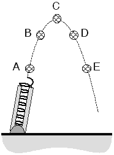

{: .image-right } A baseball is shot into the air from a spring loaded cannon.  The diagram shows the ball at five locations.  At which location is the magnitude of the acceleration least?

1. Position A
2. Position B
3. Position C
4. Position D
5. Position E
6. Position B and D
7. Position A and E
8. None of the Above
9. Cannot be Determined

### Answer

The ball's acceleration is 9.8 m/s2 (down) throughout its
entire motion (assuming air resistance can be neglected). Answer (8) is
the best choice.

### Background

Students should have some experience analyzing the velocity of objects
undergoing free-fall motion.  Issues to consider: (1)  Do students think
that the acceleration is zero at the maximum height, where the ball
momentarily stops?  (2) Do students think that the acceleration points
in the same direction as the velocity?  (3) Can students apply the
definition of acceleration to a familiar situation?

The goal is to have students confront existing misconceptions: 1)
Students often believe that the acceleration must point in the direction
of the motion; and 2) Students often believe that the acceleration is
9.8 throughout free fall but zero at the top of the trajectory since the
vertical speed is zero there.

### Questions to Reveal Student Reasoning

* What is the acceleration of the ball on the way up? What is the
direction of the acceleration? Is the acceleration changing?
* What is the acceleration of the ball on the way down? What is the
direction of the acceleration? Is the acceleration changing?
* How can you determine whether the acceleration is zero at the maximum
height? Is the velocity of the ball changing at the maximum height?
* What causes this acceleration?

### Suggestions

Ask students to apply the operational definition of acceleration (take
the velocity vector just after C and subtract the velocity vector just
before C and divide by the time interval).  Have them compare the x/y
component of the velocity just before C with the x/y component of the
velocity just after point C.

For students who persist in thinking that both the velocity and
acceleration are zero at the top of a trajectory, contrast the
subsequent motion with that of an object sitting at rest on a surface.
