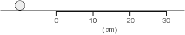
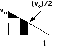
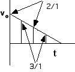

A marble rolls onto a piece of felt that is 30 cm in length. At 20 cm
the speed of the marble is half of its initial value. Which of the
following is true? Assume that the acceleration is constant on the felt.

1. The marble will come to rest on the felt.
2. The marble will go past the end of the felt.
3. What will happen cannot be determined.

### Answer 
{: .image-right }  (1) The marble will come to rest on the felt.  A graph of velocity vs. time is helpful for analyzing this problem.  The distance traveled while slowing down to half its initial speed (i.e., the first 20 cm) is three times the additional distance (i.e., the distance beyond 20 cm) the marble will roll before coming to rest.  This can be seen by comparing the areas for
these two different time periods. The marble will come to rest at approximately 26.7 cm. 

### Background
{: .image-right }  Students should have some experience using the concept of acceleration to solve kinematics problems and analyze graphs.  The answer is less important than how students represent the problem and how they approach solving the problem.

### Issues to Consider
(1) Do students only solve the problem using algebraic methods?  (2) To what extent do students use other approaches?  (3) Do students use graphical methods involving areas?  (4) Do they compare average speeds for the two periods (i.e., the period covering the first 20 cm and the remaining period of time before the marble comes to rest)?  (5) Do they compare the actual speeds of the marble at each instant of time for the two time periods (the ratio is usually greater than or equal to 2/1 at each corresponding time, as shown in the accompanying graph).  (6) Even if the students use algebraic methods, do they employ a strategy or do they do so mindlessly?

### Questions to Reveal Student Thinking
Ask students to consider the following context (which they are familiar with and is algebraically simple): an object is dropped from rest.  How fast is it moving after one second? ... after two seconds? ...after three seconds?  How far has it traveled after one second? ...after two seconds?...after three seconds?  What is the relationship between velocity and position?  Why is the relationship not linear?

###Suggestions
If students do not use a graph to solve the problem, ask them to draw a velocity vs. time graph for the situation and then use the graph to solve the problem.

A demonstration is possible.
