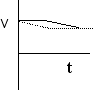

A cart rolls across a table two meters in length.  Half of the length of
the table is covered with felt which slows the cart at a constant rate. 
Where should the felt be placed so that the cart crosses the table in
the least amount of time?

1. On the first half of the table
2. Centered on the table
3. On the second half of the table
4. It doesn't matter where the felt is placed
5. None of the above
6. Cannot be determined

### Answer

{: .image-with-caption }  The
felt should be placed on the second half of the table.  After the cart
rolls across the felt it will travel at a lower speed.  To minimize the
time to cross the table one must minimize the time the cart spends at
the lower speed.  The graph to the right illustrates the point for the
two extreme cases:  felt on first half (gray curve) and felt on second
half (black curve).   The velocity vs. time graph for the case where the
felt is on the second half of the table is above the velocity vs. time
graph for all other possibilities.  Answer (3) is the best choice.

### Background

Students should have some experience using the concepts of velocity and
acceleration to solve kinematics problems and analyze graphs.  The
question students need to answer is what configuration will permit the
cart to travel at a higher speed for the longest period of time (or the
lowest speed for the shortest period of time).  A graph provides support
for a conceptual argument.

Issues to consider: (1) Can students reason and analyze a situation
involving constant acceleration.  (2) Do students try to solve the
problem using algebraic methods?  (2) Can students use graphical methods
and conceptual reasoning? (3) Can students verbalize the central idea --
an object will travel a certain distance in less time if its speed is
higher?

### Questions to Reveal Student Thinking

Where is the cart moving the fastest? ... the slowest?

What does a graph of the velocity vs. time look like?

How do you determine when the cart has reached the end of the table from
a graph of velocity vs. time?

### Suggestions

Try some limiting cases.  If the piece of felt were small (say 10 cm)
but slowed the cart from 1 to .8 m/s on a 3m table.  Approximately how
long would the trip take if the felt were placed at the beginning of the
table?...at the end of the table?
...
