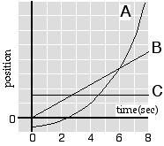

{: .image-right }  The plot of position versus time is shown for three objects.  Which object has the largest acceleration at t = 2.5s?

1. Object A only
2. Object B only
3. Object C only
4. Both B and C
5. Both A and C
6. Both A and B
7. All three have the same acceleration at t = 2.5s
8. None of the above
9. Cannot be determined

### Answer

(1); the slope of position v. time is velocity, and the slope of
velocity v. time is acceleration.  The only plot with a non-zero
(positive) acceleration is A.  Plot C denotes zero velocity, and plot B
denotes a constant velocity.

### Background

It is important for students to develop multiple ways of interpreting
concepts.  Graphical representations are often more useful than
algebraic representations in solving kinematic problems.  In this
instance students must recognize the signature of acceleration in a plot
of position vs time.

### Questions to Reveal Student Thinking

How can you determine if an object is accelerating?  For which objects
is the velocity changing.  What are some examples of objects moving
according to the graphs?

What features about a position vs. time graph indicate that an object
has a zero velocity?  a zero acceleration?  What features indicate a
negative acceleration?  a positive acceleration?

### Suggestions

Draw a graph of velocity vs. time for each object. Then draw the graph
of acceleration vs. time.

Follow up question: Can the position vs. time of an object have a
negative slope at some specific time, and yet the acceleration be
positive at that same time? 
