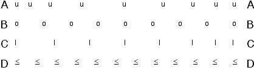

## The question for students:

Below is shown a strobe diagram indicating the position of four objects
at successive (equal) time intervals.  The objects move from left to
right.

During the intervals shown, which of the objects are accelerating?

1. Object A only
2. Object B only
3. Object C only
4. Object D only
5. Objects A and B
6. Objects B and C
7. Objects A and C
8. None of the above
9. Cannot be determined

## Commentary for teachers:

### Answer

(7) (A) and (C) are clearly accelerating since the displacement is
different for different time intervals (implying different average
velocities).  For (B) and (D) the average velocity is the same for each
time interval.

If there is something quirky about the motions of (B) and (D), it is
possible that these objects are accelerating even though their average
velocity is always the same for the time intervals observed.  Therefore
students could be justified in selecting (9).  Students should realize
that (A) and (C) are accelerating.

### Background

It is important for students to develop multiple ways of interpreting
concepts.  This ensures that students are not just following rote
procedures to answer questions.  Once an idea is understood students
should be able to use their understanding in a variety of contexts and
with a variety of representations.

### Questions to Reveal Student Thinking

Which objects have a non-zero velocity?  How do you know?  How can you
determine from an object's position at several times whether it is
accelerating?  What features of a strobe diagram indicate that an object
has a non-zero velocity?  a non-zero acceleration?

What are some physical situations that correspond to the different
motions in the strobe diagram.

### Suggestions

Draw position vs. time graphs and velocity vs. time graphs for the
motion of objects that are difficult for students to analyze.
