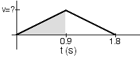

A skateboarder heads straight up a steep bank angled at 45&deg;, the
whole time experiencing a constant acceleration.  She manages to move
1.6m up the incline before rolling back down.  The entire maneuver takes
her 1.8 s, half of which is going up, the other half going down.  What
magnitude acceleration did she experience while on the incline?

Consider the steps in the following procedure. If the procedure is
incorrect, respond with the number of the first incorrect step; if not,
respond with step 7.

{: .image-right } 

1. The velocity vs. time graph for the situation is as shown.
2. It takes the skateboarder 0.9 s to reach the highest point.
3. The shaded area of the graph equals her displacement along the incline which is 1.6m.
4. Equate this area (1/2 (0.9)v) to 1.6 and solve for v.
5. Use v to find the slope of the velocity vs. time graph.
6. The slope is equal to the acceleration.
7. The procedure is correct.

### Answer

(1) The graph does not describe the situation.  The acceleration is
constant.  The velocity is not zero at t=0s, but is zero at t=.9s.

### Background

This question requires students to make decisions and judgements which
are needed when solving kinematics problems with understanding.  This
provides another opportunity to check students skills interpreting
graphs and connecting the graph to the physical situation.   Students
may still be looking at superficial features of the graph to determine
its validity.

### Questions to Reveal Student Reasoning

Where is the skateboarder's velocity zero?  ... velocity largest?   Does
this information match the graph?

What is her initial position?  ... her final position?  Does this
information match the graph?

### Suggestions

Write out the appropriate solution plan.  Ask students to compare the
answers for the two approaches.  Does an invalid plan necessarily lead
to an incorrect answer?  Why or why not?  Does a valid plan necessarily
lead to a correct answer?  Why or why not?
...
