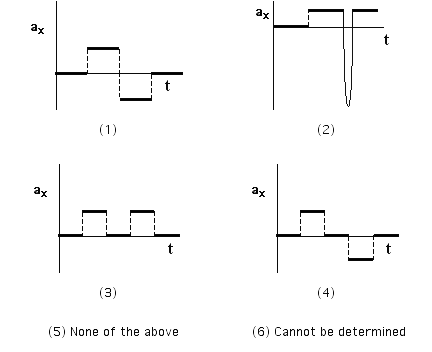

A soccer ball rolls across the road and down a hill as shown below.  At
the bottom of the hill the ball is given a quick kick so that the ball
goes back up the hill and across the road.  The initial and final speed
of the ball is the same.

Which of the following sketches of ax vs. t is a reasonable
representation of the horizontal acceleration of the ball as a function
of time for period of time shown?

### Answer

(2) The acceleration of the ball while on the slope is the same whether
it is going down or going up.  Also, taking the positive direction to
the right, the kick would appear as a negative spike in the
acceleration.

### Background

This item is related to item 1.  See comments there.  Students need to
note that the plots are for the xcomponent of the acceleration.

### Questions to Reveal Student Reasoning

How is the acceleration related to the velocity?  Suppose the hill were
more inclined.  What feature of the acceleration vs. time graph would
change?  What is the direction of the velocity just before the kick? 
just after?

### Suggestions

Have students make a graph of velocity vs. time for each of the given
plots of acceleration vs. time.   Have students generate a plot of the
acceleration and velocity in the y direction.  
