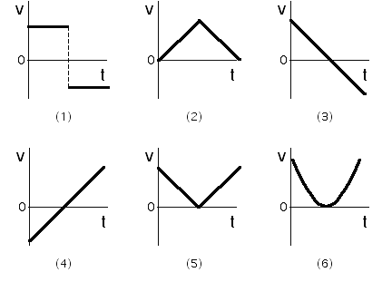

Which of the velocity vs. time plots shown below might represent the
velocity of a cart projected up an incline?

Select one of the above or:

(7) None of the above

(8) Cannot be determined

### Answer

(3) or (4).  Initially the cart has a non-zero velocity pointing up the
incline.  The speed of the cart decreases as it moves up the incline,
reaching zero at its maximum height.  The speed of the cart increases as
the cart moves down the incline.  The velocity at the bottom of the
incline points down the incline.  Graph (3)/(4) is correct if up/down
the incline is taken as the positive direction.

### Background

Students will often associate velocity time graphs with features of the
terrain.  Many will pick either (5) because they neglect the vector
nature of velocity and think about the speed.

### Questions to Reveal Student Reasoning

Is the velocity ever zero?  Is the velocity ever positive? ... negative?
 When?  Is the velocity constant?  How do you know?

### Suggestions

Plotting the position vs. time may help students come up with the
correct plot of velocity vs. time.
