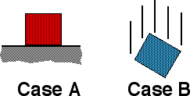

The two blocks shown below are identical.  In case A the block sits on a horizontal surface and in case B the block is in free fall.

Which of the following statements are true regarding the reaction force to the gravitational force exerted on each block?

1. In case A the reaction force is the Normal force.
2. In case B the reaction force is zero.
3. The reaction force is larger in A than B.
4. All the above are true.
5. Only (1) & (2) are true.
6. None of the above are true.
7. Cannot be determined.

### Answer

(6) The reaction force to the gravitational force exerted (by the
earth) on a block is the gravitational force exerted (by the block) on
the earth. In both cases the reaction force is non zero and because the
blocks are identical the reaction forces for the two cases are
equal.

### Background

Newton's third law can be counter intuitive to many students and the
concept of reaction force can be very confusing. Students often think
that the reaction force to some force exerted on an object is a
balancing force on the same object.

(1) Many students will think the normal force is the reaction force
because it is equal and opposite to the gravitational force exerted on
the block.

(2) Some students may reason that since there is no balancing force
there is no reaction force.

### Questions to Reveal Student Reasoning

What is a reaction force? What are some examples? Do action-reaction
force pairs act on the same, or different bodies? Why is reaction force
an important idea?

### Suggestions

Reaction force is an abstract concept. It cannot be demonstrated. One
needs to make sure students understand its definition. The first step is
to make sure students understand the idea of an interaction: When two
objects affect each other (i.e., influence each others motion, or shape)
then we say that the objects interact. We find that all interactions are
two-way: if the motion/shape of one of the interacting objects is
affected then the motion/shape of the other object is always affected.
We ultimately quantify the effects and refer to the causes of these
effects as forces. An interaction involves two forces, one on each
object. Action-reaction pair refer to the two parts (forces) of an
interaction. Newton's third law states the relationship between the two
parts (forces) of an interaction: the two forces are equal in magnitude
and point opposite in direction.
...
