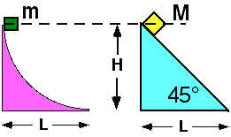

Two masses, m and M, are released from rest at a height H above the
ground.  Mass m slides down a curved surface while M slides down an
incline as shown.  Both surfaces are frictionless and M > m.

Which of the following statements is true?

1. The time it takes for m to reach the end of the surface is longer because the path it takes is longer.
2. The time it takes is the same since both masses are released from the same height.
3. The time it takes for M to reach the end of the incline is less because its horizontal acceleration is larger.
4. The time it takes for m to reach the end of the surface is shorter because it has a larger acceleration initially and therefore builds speed more quickly.
5. The time it takes is the same since both masses have the same displacement.
6. The time it takes is the same because both masses have the same speed at the end.
7. The times cannot be compared without knowing the masses of the blocks.
8. More than one statement above is correct
9. None of the above statements is correct.

### Answer

(4); even though both blocks arrive at the bottom with the same speed, m
has a larger initial acceleration and attains a larger speed faster than
M, despite having to travel a slightly longer distance.  This item helps
to focus attention on identifying those salient characteristics of the
problem that relate to the time it takes the blocks to slide down the
ramps.   Some students will cue on the distance traveled, some on the
differing masses of the blocks, some on m picking up speed faster than
M.

### Background

The curved surface makes it impossible for students to use either
kinematics or Newton's Second Law to determine the exact time it takes m
to reach the bottom.  Some students may correctly conclude that both
blocks arrive at the bottom with the same speed, and thereby erroneously
conclude that this must mean they arrive at the same time as well.

The curved track case also offers an opportunity to explore whether
students realize that the total work done by the gravitational force
goes into changing the kinetic energy of the block, even with a normal
force present since this normal force does no work on the block.

### Questions to Reveal Student Reasoning

What features of the problem determine the time it takes the masses to
reach the bottom?

What's the same about both blocks if they are released from the same
height?  What's different?

Does traveling a shorter distance always mean less time?

### Suggestions

For those who answered (1), ask what would happen to the time it would
take M to reach the bottom if the 45&deg; angle were made more, or less
steep (think of the top vertex of the triangle being on a hinge). 
Clearly in the limit where M would drop vertically a distance
SQRT(H2+L2), the time it would take to reach the
other vertex of the hypoteneuse would be shorter than for any angle less
than 90&deg;.
...
