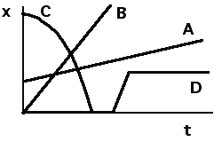

## The question for students:

Position vs. time graphs are given below for four different objects.

Which of the objects experiences a net force sometime during the time
period shown?

1. Only object A
2. Only object B
3. Only object C
4. Only object D
5. Objects B and D
6. Objects A and C
7. Objects B and C
8. None of the above
9. Cannot be determined

## Commentary for teachers:

### Answer

(8) is the appropriate response because both C and D experience a force
during the time interval.  A and B have constant velocity because the
slope of their x vs. t plot is constant.  Some students may not realize
that D experiences a force because they will reason that D has constant
velocity at any given time.  However, D must experience a force to
change its velocity.

### Background

Recognizing the signature of acceleration from a plot of position vs.
time is an important skill for students to develop.  Because of
familiarity, they may recognize the plot of position for a falling body
and reason that the object experiences a gravitational force.  This
question requires two logical steps.  First recognizing the consequence
of constant velocity and second recognizing that a change of velocity
indicates acceleration and therefore force.

### Questions to Reveal Student Reasoning

Which objects have constant velocity throughout the time interval?

Which of the objects has the largest speed sometime during the time
interval?

Are all of the objects moving away from the origin?

### Suggestions

Have students plot the velocity of each object over the same time
interval.

Have students move objects in a manner in accord with the plots.  This
may cause them to realize when a force must be applied.  
