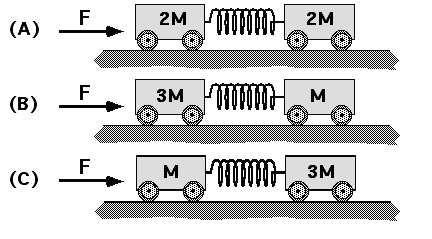

Consider the three situations shown below.  In each case two small carts
are connected by a spring.  A constant force F is applied to the
leftmost cart in each case.  In each situation the springs are
compressed so that the distance between the two carts never changes.

Which of the following statements must be true regarding the compression
of the spring in each case?  Assume the springs are identical.

1. Compression A = Compression B = Compression C
2. B = C < A
3. A < B = C
4. A < B < C
5. B < A < C
6. C < A < B
7. A < C < B
8. None of the above
9. Cannot be determined

### Answer

(5) The total mass is the same so the acceleration of the systems must
be the same.  In each case the spring exerts the only horizontal force
on the cart to the right.  The spring force must be largest for the 3M
cart and smallest for the M cart: B < A < C.

### Background

This item requires students to reason.  It is difficult to resort to
equation manipulation to answer this question.  One difficulty with the
problem is that it involves a complex system (two carts connected by a
spring).

### Questions to Reveal Student Reasoning

Is it really possible to compress the carts so that they stay a fixed
distance apart?  What forces act on each cart?  Will the carts
accelerate or move with a constant velocity?  Compare the carts
acceleration.

### Suggestions

Draw a free-body diagram for each cart.

Define a new problem in terms of the carts on the right:  Each cart is
given an applied force so that each has the same acceleration.  How do
the applied forces compare?
...
