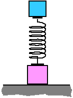

{: .image-right }  A toy
is made from two blocks and a spring as shown at right.  When the spring
is compressed and suddenly released, the toy will jump off the table
surface.  Which of the following is true about the net force on the toy
just after it is released?

1. The net force is zero.
2. The net force points up.
3. The net force points down.
4. The direction of the net force cannot be determined.

### Answer

(2); This question seems difficult but it is available
to beginning students.  Students can analyze the problem considering the
entire toy as a single system or decompose into the separate masses. 
Viewed as a single system, since the center of mass accelerates up, the
net force must point up.  Free body diagrams for each mass individually
would show no net force on the bottom mass (because the normal force
assumes a value necessary to balance gravity and spring force) and a
large net force on the upper mass (spring force exceeds gravity).  If
sketched to scale, the two can be added showing that the net force
derives from the normal force on the lower block.

### Background

This question is intended to have students distinguish between internal
and external forces.  The question also can be approached in a variety
of ways.

### Questions to Reveal Student Reasoning

Can the toy ever leave the surface?  Would there be a net force if it
did leave the surface? 
...
