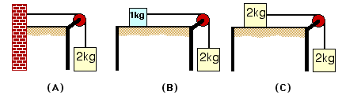

Consider the three cases presented below. Assume the friction force
between the table and block in situations (B) and (C) can be ignored.

Which of the following statements about the tensions in the strings is
true?

1. TA = TB = TC
2. TB = TC < TA
3. TA < TB < TC
4. TB < TC < TA
5. TA = TC < TB
6. None of the above
7. The relationship of the tensions cannot be determined

### Answer

(4) By applying Newton's second law to the hanging block one obtains a
relationship between the tension in the string and the acceleration of
the hanging block:  The larger the acceleration the smaller the tension
force.  The acceleration is determined by the total mass of the system.

### Background

This is a good problem for challenging students to reason without
resorting to writing down a lot of equations.  As one of the procedure
forces (tension, normal, static friction), the value of tension requires
application of the 2nd law.

### Questions to Reveal Student Reasoning

What is the tension in situation (A)?  Explain.  Is the tension equal to
the weight in situation (B)?  (If some students think so explore what
the net force is on the hanging mass, which will lead to a net force of
O, and a contradiction since this implies O acceleration.)  Of systems
(A) and (B), which has the larger acceleration?

### Suggestions

Ask students to consider limiting cases.  What if the string was not
attached to a block on the table (or if the block had almost no mass)? 
What would happen if the block on the table had a very large mass ?
...
