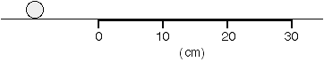
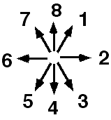

A marble rolls on to a piece of felt and slows down.

Indicate the direction that most nearly corresponds to the direction of
the force that the marble exerts on the felt.  If none of the directions
are appropriate, or if the answer cannot be determined, respond (9).

### Answer

(3) The force the felt exerts on the marble is up (normal force) and to
the left (friction force).  Newton's third law tells us that the force
the marble exerts on the felt must be down and to the right.  Students
may focus on the normal force alone (4) or the friction force alone (2).
 These are not two forces, but the components of a single force. 
Students also find it difficult to extract some information from the
dynamical statement "slows down" and integrate this with the familiar
normal force.

### Background

This presents an interesting twist to students.  The friction force is
usually formulated in terms of a moving object and a fixed surface. 
Students may not know for sure whether there is a friction force on the
felt - the felt is not moving.  The analysis on the marble is reasonably
straightforward.  Newton's third law can be used to determine the force
on the felt if the force cannot be determined from the situation
directly.

### Questions to Reveal Student Reasoning

Question students about how they got their answer.  Did they use the
force laws that they learned previously?   Did they use Newton's second
or third laws?

### Suggestions

Instead of a marble consider a sliding block and see if students think
differently - some students will have difficulty thinking about friction
with a rolling object.
