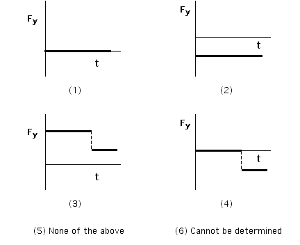

A soccer ball rolls across the road and down a hill as shown below.

Which of the following sketches of Fy vs. t represents the net vertical
force on the ball as a function of time?

### Answer

(4); on the horizontal partion there is no net force, and therefore no Fy. On the slope the net force in the y direction is due to gravity and a component of the normal force.  Alternatively, since the ball accelerates along the slope, the net force must be parallel to the slope and have a component in the vertical direction.
