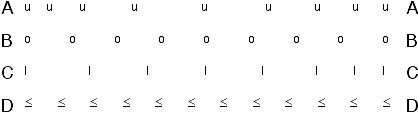

Below is shown a strobe diagram indicating the position of four objects
at successive time intervals.  The objects move from left to right.

Each of the objects shown experiences a constant friction force as they
slide across the floor.  Which of the objects definitely experiences a
force in addition to sliding friction?

1. Object A only
2. Object B only
3. Object C only
4. Object D only
5. Objects A and B
6. Objects B and C
7. Objects A and C
8. None of the above
9. Cannot be determined

### Answers

(8); Object (C) slows down and this could be due to a sliding friction force acting to the left. Given that there is a friction force, the objects moving with constant velocity (B and D) must have an additional force. Likewise (A), which accelerates duting the first part of its motion, must have an additional force to the right.
