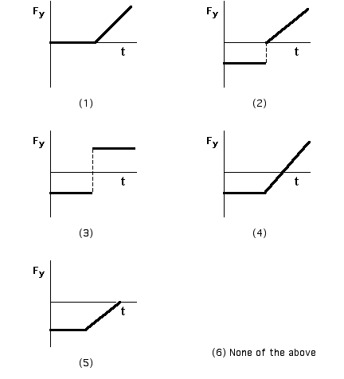

A block is dropped onto a vertical spring.  Which net force vs. time
graph best represents the net force on the block as a function of time? 
Consider only the motion of the block from the time it is dropped until
it first comes to rest.

### Answer
(4); Some students may select (5) confusing the equilibrium point with the point where the block comes to rest. Students selecting (2) are ignoring gravity after the block hits the spring.
...
