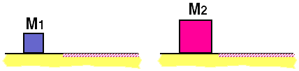

Two blocks, M2 > M1, having the same speed move
from a frictionless surface onto a surface having friction coefficient
&mu;k as shown below.

Which block stops in the shorter time?

1. M1
2. M2
3. Both blocks stop in the same time.

### Answer

(3); both blocks have the same acceleration and the same initial
velocity, so they must stop in the same length of time.

### Background

This problem can be reasoned through without the use of equations. 
However, the problem can be solved easy enough algebraically.   The item
provides an opportunity for students to reflect on different approaches
for solving problems.

### Questions to Reveal Student Reasoning

Which block experiences the largest net force?

Which block experiences the largest acceleration?

What determines which block stops first?

### Suggestions

Ask students to consider the following questions, and to determine if
their answer to the problem is inconsistent with their answers to these
questions:

If two blocks enter the rough region side by side and have the same
mass, which one will stop first?

If the blocks are connected by a rope, will the time it takes for the
blocks to stop change?  Would the time it takes to stop change if the
blocks were glued together?
...
