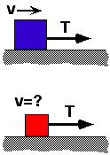

{: .image-right }  
A block is on a horizontal surface. When the block is pulled by a rope under
tension T, the block moves with constant speed.  If the same tension were
applied to a smaller block made of the same material and at rest on the
same surface, the block would:

1. Remain at rest. 
2. Accelerate. 
3. Move with constant speed. 
4. None of the above. 
5. Cannot be determined.

### Answer

(5); in the first case, the net force is 0, so T=&mu;kMg.  In
the second case, the static friction force must be overcome for m to
move.  Since &mu;s&gt;&mu;k, but m&lt;M, it cannot
be determined if &mu;smg is smaller or larger than T.

### Background

This item requires that students combine knowledge from different
topics: Static Friction, Kinetic Friction, and Newton's Second Law. 
Students have to deduce information (e.g., in the first situation
students must deduce that the kinetic friction force is balanced by the
tension force to give a net force of 0).  Students must also know that,
since the static friction coefficient is larger than the kinetic
friction coefficient, the maximum static friction force is larger than
the kinetic friction force.  Finally, students must be able to reason
about compensating quantities-in this case, although m goes down, &mu;
goes up, so the product of m, &mu;, and g may, or may not, be larger
than T.  The relationship between students' answers and their
assumptions should be the focus of the class discussion, not the
correctness of any particular answer.

### Questions to Reveal Student Reasoning

Why does the block of mass M move with constant speed?  If the block of
mass M were at rest would the tension force cause it to move?

What quantities affect the size of the friction force?

What determines whether the block of mass m will move?

### Suggestions

Ask students to consider the limiting case where m is less than, but
almost equal to M.  What would happen if m were pulled with tension T. 
Students should be able to reason (perhaps with some coaching) that m
will remain stationary since the maximum static friction force is larger
than T.

Then ask them to consider the limiting case where m is much less than M.
 What would happen if m were pulled with tension T.  Students should be
able to reason that m will accelerate.

Finally, ask what happens "in between" these two limiting cases.
