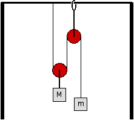

Consider the arrangement of pulleys and masses shown below.  The masses
of the pulleys are small.  Ignore friction.

For what relationship of the masses would the masses remain at rest?

1. m/M > 2
2. m/M = 2
3. m/M = 1.5
4. m/M = 1
5. m/M = 0.5
6. m/M = 0.25
7. m/M < 0.25
8. none of the above
9. Cannot be determined

### Answer

(5); This problem can be reasoned although it is easy enough to solve algebraically. The problem is useful for demonstrating the value of free body diagrams for reasoning.
