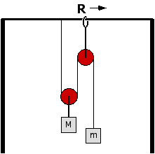

Consider the arrangement of pulleys and masses shown below. The masses
of the pulleys are small.  Ignore friction.

This system is initially at rest.  What will happen if the ring R is
moved to the right?

1. Nothing will happen.
2. Mass M will go up and m will go down.
3. Mass M will go down and m will go up.
4. Both masses will go down.
5. Both masses will go up.
6. Cannot be determined because what happens depends on the masses.

### Answer

(3) If the ring is moved to the right the upward force on M is
decreased,so M will accelerate downward. Initially the tension is Mg/2.
When the strings are at an angle the tension is insufficient to support
M.

### Background

Answers are not as important as approach. What did students do to
understand the physical situation? Did they draw pictures? Did they draw
a free-body diagram?

### Questions to Reveal Student Reasoning

Does the tension stay the same? ...increase? ...decrease? After moving
the ring, would I need a smaller or larger mass M to keep the system
from moving?

### Suggestions

After students make predictions and discuss their reasoning have
students vote a second time. Then demonstrate what happens.
