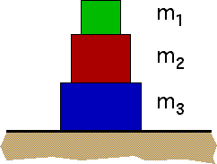

## The question for students:

Three blocks are stacked as shown below.

How many forces are acting on the bottom block (m3)?

1. One force
2. Two forces
3. Three forces
4. Four forces
5. Five forces
6. Six forces
7. More than six forces
8. No forces act on the block
9. Cannot be determined

## Commentary for teachers:

### Answer

(3); The gravitational force exerted by the earth, the normal force
exerted by the horizontal surface, and the normal force exerted by the
block with mass m2.

### Background

Some students have difficulty distinguishing between direct and indirect
interactions.  Students may take the view that m1 directly
exerts a force on m3.   This view is often verbalized as "the
weight of block m1 is exerted on m3."

It is helpful to classify forces into action-at-a-distance forces, such
as gravity and electromagnetism, and contact forces.  Students can then
employ a strategy for identifying all the forces since every object
touching a body will give rise to a force.  The only exceptions are the
fundamental forces, which is an easily exhausted list.

### Questions to Reveal Student Reasoning

Does m3 exert a force on m1?

What part of m2 interacts with m3?  What part of
m1 interacts with m3?

Is weight a force?  If so, what object exerts the force?

Can an object interact with another object without touching it?  If so,
when?  If not, why not?

Is the normal force exerted by m2 on m3 less than,
equal to, or greater than the weight of m2?

### Suggestions

If one pushes on both sides of a bathroom scale the scale reading will
change.  What does the scale measure.  How is the reading related to the
forces exerted on the scale?

If bathroom scales are placed between the blocks, what forces would each
scale measure (assuming that the scales themselves have very little mass
compared to the mass of the blocks)?
