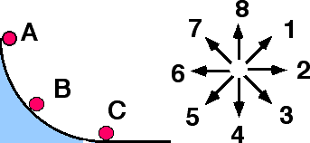

## The question for students:

A small ball is released from rest at position A and rolls down a
vertical circular track under the influence of gravity.

When the ball reaches position B, which of the indicated directions most
nearly corresponds to the direction of the normal force on the ball?

Enter (9) if the direction cannot be determined.

## Commentary for teachers:

### Answer

(1) By definition the normal force is always perpendicular to the
surface at the point of contact, independent of the motion of the object
and the shape of the surface.  The direction of the normal force is away
from the surface and toward the object in contact with it.

### Background

When the normal force is introduced to students, a flat surface is used
to illustrate the concept.  Flat surfaces are also used in the majority
of problems that students solve.  This item extends the context so that
students consider the normal force exerted on an accelerated object
moving on a curved surface.

Those who answer (8) may be thinking that the normal force always
opposes the gravitational force, as when an object is resting on a
horizontal surface.

Students who answer (5) may be indicating the direction of the normal
force exerted on the curved track by the ball.

### Questions to Reveal Student Reasoning

If a ball were on a flat horizontal surface, what would be the direction
of the normal force?  What would be the direction of the normal force if
the ball were rolling across a flat horizontal surface?  What would be
the direction of the normal force exerted on a block at rest on an
incline?  What would be the direction of the normal force on a ball
rolling down an incline?

What direction(s) are perpendicular to the track at point B?

### Suggestions

The direction of the normal force is essentially a matter of definition.
 The track exerts a force on the ball.  Dividing this force into a
component perpendicular to the surface (called the normal force) and a
component tangential to the surface (called the friction force) is a
choice, which is made because it is useful to do so.   Definitions are
difficult to get across to students because there are no demonstrations
one can do to show that the normal force points in a particular
direction.  The only thing one can verify is how the definition is
applied by students in a diverse set of contexts.
