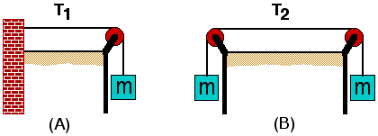

Consider the two situations presented below.  T1 is the tension in the string in case A and T2 is the tension in the string in case B.

Which of the following statements is correct?

1. T1 < T2
2. T1 = T2
3. T1 > T2
4. Cannot be determined

### Answer

(2).  The force exerted on each block by the attached string must
balance the weight of the block.  Since the blocks all weigh the same
amount, the tension in the in the two strings must be equal.

### Background

This item does not require formal knowledge of Newton's Second Law.  It
can be used after students can identify the tension and gravitational
force, provided they appreciate that for static situations the forces
exerted on each object must balance.  Try asking students to answer the
question individually and without discussion, giving their initial 
reaction.  Then ask students to re-answer the question after discussing
it briefly in small groups.

Students commonly  think that T2 is greater than
T1 because the rope in situation 2 "supports" two masses. 
This incorrect intuition can even exist in students who are capable of
drawing correct free-body diagrams and who know that the "tension" force
exerted on each block must balance the weight of the block.  The
coexistence of conflicting intuition and formal knowledge is common
among novices.

### Questions to Reveal Student Reasoning

What is tension?  How do you measure tension?

For situation (A) consider placing a spring scale between the string and
the block in the vertical region.  What force is the spring scale
measuring?  For situation (A) consider cutting the string in the middle
of the horizontal region and inserting a spring scale.  What force is
this spring scale measuring?  How would the readings on the two spring
scales compare?

If spring scales were placed similarly in situation (B), how would their
readings compare to the readings on the spring scales in situation (A)?

### Suggestions

Consider the original situations and two variations:  (a) In (A)
consider a person holding the string in place of the wall;  (b) In (B)
consider a person holding the string in place of the block on the left. 
In each situation, what force is being exerted on the string so that the
hanging mass at the other end does not move?

Set up the two situations depicted in the item.  Insert spring scales at
appropriate points.  Discuss the readings on the scales.
...
