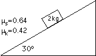
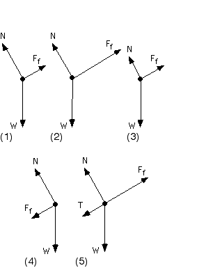

{: .image-right }  A
block of mass 2 kg is at rest on the surface of a wedge that makes an
angle of 30&deg; with the horizontal as shown.  The coefficient of
static friction is 0.64 and of kinetic friction is 0.42.

Which figure below best represents the free-body diagram for the block?

6\. None of the above  
7\. Cannot determine the free-body diagram

### Answer

(1).  The component of the gravitational force parallel to the incline
will balance the frictional force in this situation.  The component of
the gravitational force perpendicular to the incline must balance the
normal force.

### Background

Even in static situations students can be confused about the relative
sizes of forces.

### Questions to Reveal Student Reasoning

What forces are present?  What determines how big the gravitational
force is?  ... the normal force is? ... the gravitational force is?
