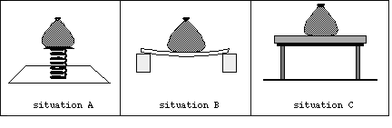

A water balloon is shown at rest in three different situations. In each
case the water balloon is in contact with a system that supports it.

Which system exerts the largest force on the balloon?

1. Spring support in A
2. Cardboard and blocks in B
3. Table in C
4. None of the systems exert a force
5. None of the above
6. Cannot be determined

### Answer

(5).  Each system exerts the same magnitude force on the balloon.  The
size of the force equals the weight of the balloon.

### Background

Context for Use: Give to students before they receive a formal
introduction to interactions.

Assessment Issues: (1) What are students' naive views about
interactions?  (2) Can students perceive when an interaction is
occurring?  (3) What factors do students attend to when determining
whether a force is present?  (4) What factors do students use to compare
the relative magnitude of two forces?

### Questions to Reveal Student Reasoning

Which systems exert a force on the balloon?   How did you decide whether
the system exerts a force on the balloon?  In each case how did the
force affect the balloon?  How did the interaction between the balloon
and system affect the system?  When comparing two forces, how can you
tell which force is larger?

### Suggestions

Recognizing the presence of an interaction is a difficult problem for
students.  One must return to the topic repeatedly as additional
understanding and principles are learned by the students.  Initially
focus students on the effects of interaction: (1) Do the motions of the
objects change?  (2) Do the shapes of the objects change? 
...
