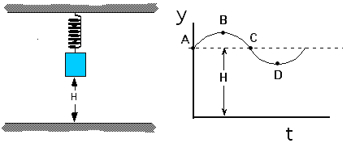

A block attached to the end of a spring is hanging at rest from the
ceiling as shown at the left below.  After the block is pulled down and
released it moves up and down for an extended period of time.  The
motion during one cycle is shown in the graph at right below.

Several points are indicated on the graph.  At which point is the spring
force exerted on the block the greatest?

1. Point A
2. Point B
3. Point C
4. Point D
5. Points B and D
6. Points A and C
7. The spring force is always the same
8. None of the above
9. Cannot be determined

### Answers

(4).  The spring force is largest at the position where it is compressed
or stretched the most relative to its natural length.  The spring is
already stretched when it is at a height H because there must be an
upward spring force to balance the gravitational force on the block.  As
the height of the block is decreased the spring is stretched further. 
As the height of the block is increased the spring is stretched less -
if raised enough the spring would start to compress.

### Background

Many students will attempt to apply the spring force law without real
understanding.   This problem requires students to understand the
physical situation and to interpret graphical information about the
height of the block to reason out an answer.

### Questions to Reveal Student Reasoning

What is the force law for a spring?   How does the spring force compare
to the weight of the block?  At what points is the spring stretched? ...
compressed?

### Suggestions

Demonstrate with a spring that a vertical spring stretches when a weight
is attached.  Show that as the weight moves up and down that the spring
need never get back to its natural length (i.e., it is always stretched)

Draw free-body diagrams, especially for points B and D.
