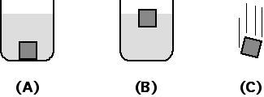

Consider three identical blocks as shown below.  In case A the block
sits on the bottom of a beaker filled with oil.  In case B the block
floats on water.  In case C the block is free-falling.

Which block or blocks experience the smallest gravitational force?

1. Block A 
2. Block B 
3. Block C 
4. Blocks A and B 
5. Blocks A and C 
6. Blocks B and C 
7. They all experience the same gravitational force 
8. None of the above 
9. Cannot be determined

### Answer

(7).  The gravitational force is approximately the same for all three
blocks assuming that they are about the same height above the surface of
the earth.  The gravitational force on an object near the surface of the
earth depends only on the mass of the object.

### Background

Students' models concerning what factors influence a force can be quite
complex.  Introducing students to a force law (conceptually or
mathematically) is usually not enough to correct any false associations.
 Only through discussion of the force law in a variety of contexts will
the student develop a model more consistent with the physicists' model.

### Questions to Reveal Student Reasoning

What causes the gravitational force?  What are some factors that
influence the gravitational force?  Make a list.  What is the
gravitational force law?  Which of the listed factors are contained in
the force law?

### Suggestions

What would be the gravitational force on the block if it were sitting on
a table?

Suppose the block was falling through oil or that you dropped the beaker
in case A.  Would the gravitational force change?
...
