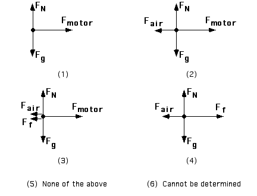

## The question for students:

A car accelerates down a straight highway. Which of the free-body
diagrams shown below best represents this situation?

## Commentary for teachers:

### Answer

(4) is the best response. Students often think of the motor as the source of force propelling the car when it is the friction force on the tires that enable the car to move forward. Sometimes it helps to discuss the process of walking on a perfectly slippery surface (ice) to enable students to see the role of friction for forward motion.
