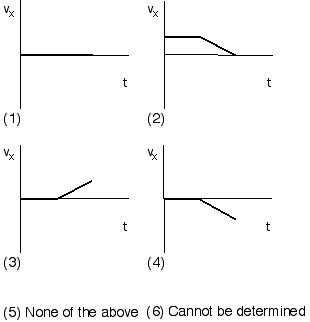
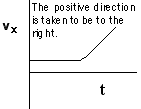

A soccer ball rolls across the road and down a hill as shown below.

Which of the following sketches of vx vs. t represents the
horizontal velocity of the ball as a function of time?

### Answer

{: .image-right } 
(5) None of the above.  The ball crosses the road in a straight line at
a more-or-less constant speed (perhaps slowing down slightly) provided
that the road is in good condition and the rolling friction between the
ball and road is sufficiently small.  As the ball rolls down the hill it
will speed up, and so there will be an acceleration in the direction of
motion, with a non zero component to the right.  The following graph is
a reasonable representation of the horizontal velocity as a function of
time.

### Background

This problem could challenge students in several areas:  (1) Can
students recognize how the velocity is changing?  What criteria do they
use?  (2) Do students realize that as the ball moves down the hill it
speeds up and the x-component of velocity increases?  Students may
associate the increase in velocity with the y-direction only.  (3) Do
students associate the graph with the terrain over which an object
travels?  The process of translation of a motion quantity to a graph can
be very difficult for students.  (4) Will students confuse motion
quantities? When students analyze the graphs of velocity vs. time they
may be interpreting the graphs in terms of position instead of velocity.

### Questions to Reveal Student Reasoning

Is the velocity ever zero?  Where does the ball speed up? ...slow down?
What is the direction of the velocity while the ball is on the sloped
section?  Does the velocity have a non-zero horizontal component? 

### Suggestions

Set up a demonstration with a horizontal surface and a ramp, both with
the same net horizontal displacement.  Roll a ball slowly across the
horizontal surface and down the ramp.  Ask students to judge which
horizontal displacement took more time.  Over what section (horizontal
surface or ramp) is the velocity larger on average?
