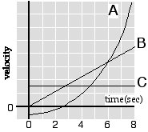

{: .image-right }  The
plot of velocity versus time is shown at right for three objects.  Which
object has the largest acceleration at t = 2.5s?

1. Object A only
2. Object B only
3. Object C only
4. Both B and C
5. Both A and C
6. Both A and B
7. All three have the same acceleration at t = 2.5s
8. None of the above
9. Cannot be determined

### Answer

(6) Objects (A) and (B) have the same acceleration (i.e., they have the
same slope for the velocity vs. time graph at t=2.5s)   Object (C) has a
constant velocity (zero slope).

### Background

After students have been introduced to acceleration, but before they are
given a procedure for determining the acceleration from a graph of
velocity vs. time.  Students should answer this question after they have
gained an understanding of the definition of acceleration, but before
they are given any explicit instruction for how acceleration relates to
a velocity vs. time graph.

### Questions to Reveal Student Reasoning

How can you determine if an object is accelerating?  For which objects
is the velocity changing.  What are some examples of objects moving
according to the graphs?

What features about a velocity vs. time graph indicate that an object
has a zero velocity?  Zero acceleration?  What features indicate a
negative acceleration?  Positive acceleration?

### Suggestions

Redraw the velocity vs. time graph for object (A) twice more.  In one
drawing approximate the curve with three straight line segments.  In the
second approximate the curve with 6 straight line segments.
...
