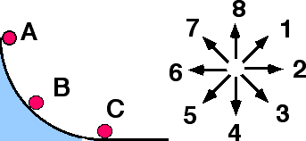

A small ball is released from rest at position A and rolls down a
vertical circular track under the influence of gravity as depicted
below.

When the ball reaches position B, which of the indicated directions most
nearly corresponds to the direction of the net force on the ball?

Enter (9) if the direction cannot be determined.

### Answer

(9) The net force is the sum of the forces acting on the ball.  If the
ball rolls along the track there is a normal force, a friction force and
a gravitational force being exerted on the ball.  Although a best answer
can be determined it would require a good understanding of dynamics,
energy, and circular motion to achieve and we assume the student is
addressing this question before all these elements are in place.  [The
actual answer is (2) but few students are able to appreciate that
without much thought.]

### Background

To become adept at identifying forces, students should consider a wide
array of situations, even if the situations are too complex for them to
fully analyze.   To determine the direction of the net force students
need to be able to judge the relative sizes of forces.

### Questions to Reveal Student Reasoning

What forces are being exerted on the ball?  What are the directions of
these forces?  What are the relative sizes of the different forces?

### Suggestions

Consider a block sliding down an incline at 450?   How does
the block on an incline compare to the ball on the curved track?  What
are some similarities and differences?
...
