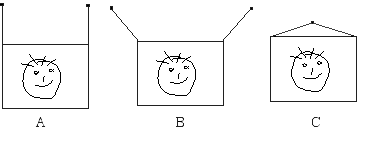

Three picture frames having the same mass are each hung from a wall
using two pieces of string.

For which situation is the tension in the two strings the greatest?

1. A 
2. B 
3. C 
4. The tension in the two strings is the same for all three situations 
5. None of the above 
6. The tension cannot be compared

### Answer

(3) The tension will be largest on the wires that are
most nearly horizontal.  The minimum tension is in the vertical wires,
and each wire has a tension equal to half the weight of the picture. 
Some students may think that the tension is the same no matter how the
wires are arranged.  One way to convince them that this is not the case
is to have two students support a heavy object by pulling on ropes
attached to the object.  As they move apart they easily perceive the
need to pull harder.
...
