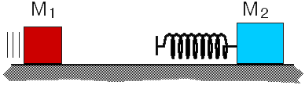
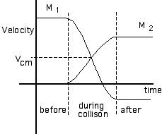

## The question for students:

Mass M1 is traveling along a smooth horizontal surface and
collides with a mass M2 (stationary) which has a spring
attached as shown below.

The spring between the blocks is most compressed when

1. all the energy in the system is potential energy stored in the spring.
2. the net momentum of the system is zero.
3. the velocity of the center of mass has its smallest value.
4. mass M1 is no longer delivering an impulse to Mass M2.
5. the only kinetic energy in the system is that of the center of mass.
6. none of the above
7. cannot be determined

## Commentary for teachers:

### Answer

5: When the spring is maximally compressed, both masses have the same
velocity which is the velocity of the center of mass.

### Background

The total energy of an isolated  system can be decomposed into three
categories; kinetic energy associated with center of mass motion,
kinetic energy of bodies in the center of mass coordinate frame and
potential energy associated with the interaction of bodies comprising
the system.

### Questions to Reveal Student Reasoning

Is M2 ever traveling faster than M1?

Do the masses ever have the same velocity?

How would you find Pcm, the momentum of the center of
mass?

How is the kinetic energy of the center of mass related to its
momentum?

### Suggestions

{: .image-right }  A
sketch of the velocities of the two masses over time would look
something like the graph at the right. [Note that the velocity of
M1 can be negative after the collision if it is less massive
than M2.]  Such a graph helps make the relationships between
Vcm, the relative velocity of the masses and the spring
compression clear.
