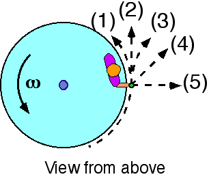

{: .image-right } A
child is standing at the rim of a rotating disk holding a rock.  The
disk rotates without friction.  If the rock is dropped at the instant
shown, which of the indicated paths most nearly represents the path of
the rock as seen from above the disk?

1. path (1) 
2. path (2) 
3. path (3) 
4. path (4) 
5. path (5) 
6. cannot be determined

### Answer

(2) is the correct path if the rock is simply dropped.  Some students
selecting answer (3) may be viewing the rock from the child's
perspective.  Some students indicating choice (5) may interpret this
path as 'straight down'.

### Background

This question is similar to others which seek to reveal student
perceptions about path persistence.  It is a slightly different context
from the purely horizontal case of a ball rolling on a horizontal
surface around an semicircular section of hoop.

### Questions to Reveal Student Reasoning

What path would the child see?

What is the velocity of the rock just before it is dropped?  just after?

What would the path of the rock have been if the child continued to hold
it?

### Suggestions

There are a variety of demonstrations that can be done as followup to
this question.  It is important that students perceive the similarity
between the demonstration context and the problem situation.
