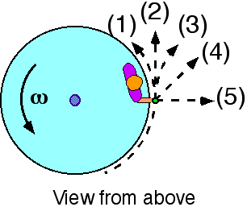

You are given this problem:

>{: .image-right } A
>child is standing at the rim of a rotating disk holding a rock.  The
>disk rotates without friction.  The rock is thrown in the RADIAL
>direction [path (5)] at the instant shown.  You are given:
>
>* Mass of the child 
>* Radius of the disk 
>* Mass of the thrown rock 
>* Velocity of the rock 
>* Initial angular speed of the system
>
>You want to find the <b>final</b> angular speed of the disk and child.

What principle would you use to solve the problem MOST EFFICIENTLY?

1. Kinematics only
2. F= ma or Newton's laws
3. Work-Kinetic Energy theorem
4. Impulse-Momentum theorem
5. Angular Impulse-Angular Momentum theorem
6. More than one of the above
7. None of the above
8. Cannot be determined

### Answer

(5) is the correct response if the rock is thrown radially.  Since there
is no angular impulse, there can be no change in angular momentum. 
Neither the rock alone, nor the child/disk system changes angular
momentum.

### Background

Throwing the rock radially, clearly increases the kinetic energy but not
the angular momentum.  Consequently, the final angular speed of the disk
and child is the same as the initial speed.

### Questions to Reveal Student Reasoning

Does the rock have angular momentum (or energy) just before it is
thrown?  just after it is thrown?

If energy (angular momentum) is gained, where does it come from?

Changes in angular momentum are caused by a net torque.  What torques
act on the system during the process of throwing?

### Suggestions

Have students relate their answer to this question to item 67.
