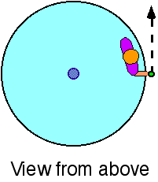

{: .image-right } A
child having mass 32kg is standing at the rim of a rotating disk of
radius 1.5m.  The disk is free to rotate without friction.  The disk has
moment of inertia I = 125kg-m2 and is initially at rest.  The
child throws a rock of mass 4kg in the forward tangential direction as
shown in the figure with a speed of 5m/s.  The final angular speed of
the disk is most nearly

1. 0.10 rad/s
2. -0.25 rad/s
3. 0.41 rad/s
4. 1.5 rad/s
5. -1.0 rad/s
6. 0.50 rad/s
7. -0.15 rad/s
8. None of the above
9. Cannot be determined

### Answer

(7) is the most appropriate response.  Initially there is no angular
momentum in the system.  The child and disk must rotate clockwise to
balance the angular momentum of the rock.  Some students may forget to
add the moment of inertia of child to that of the disk.

### Background

Throwing the rock tangentially gives the rock angular momentum relative
to the fixed center of the disk.  The disk-child system must have an
angular momentum which is the negative of that of the rock.  Thus, it is
possible to find the angular velocity.  The angular velocity is
negative, i,e, into the page.

### Questions to Reveal Student Reasoning

Does the total system have angular momentum just before the rock is
thrown?  just after it is thrown?

Does the rock have angular momentum just before it is thrown?  just
after it is thrown?

What happens to the child upon throwing the rock?  Does the child move? 
How?

### Suggestions

Have students relate their answer to this question to items 67 and 68.
...
