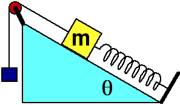

A block having mass m moves along an incline having friction as shown in
the diagram above. As the block moves a small distance along the
incline, how many forces act on the block?

1. One force
2. Two forces
3. Three forces
4. Four forces
5. Five forces
6. Six forces
7. Seven forces
8. None of the above
9. Cannot be determined

### Answer

(5) Five forces act on the block: gravitation, rope, spring, kinetic
friction (because you are told the block moves), and normal due to the
incline. Many student errors are due to the failure to identify all of
the forces acting on a body.

### Background

It is helpful to classify forces into action-at-a-distance forces, such
as gravity and electromagnetism, and contact forces. Students can then
employ a strategy for identifying all the forces since every object
touching a body will give rise to a force. The only exceptions are the
fundamental forces, which is an easily exhausted list.

### Questions to Reveal Student Reasoning

Does it matter if the block is moving up the plane or down? If the block
is at rest, how many forces MUST be acting on the block? How many forces
may be acting but you can't be sure?

### Suggestions

Set up some situations with blocks, springs and ropes and let students
practice identifying all the forces. This is a good activity to do in
conjunction with drawing free body diagrams.
