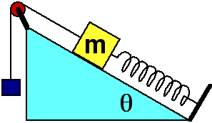

## The question for students:

A block having mass m moves along an incline having friction as shown in
the diagram above. The spring is extended from its relaxed length. As
the block moves a small distance up the incline, how many forces do work
on the block?

1. One force
2. Two forces
3. Three forces
4. Four forces
5. Five forces
6. Six forces
7. Seven forces
8. None of the above
9. Cannot be determined

## Commentary for teachers:

### Answer

(4) Four forces do work on the block: gravitation, rope, spring, kinetic
friction (because you are told the block moves). The normal force does
no work.

### Background

Recognizing those forces that do work is an important skill for students
to master. They also need to recognize whether the work is positive or
negative.

### Questions to Reveal Student Reasoning

As the block moves up the plane, which forces do positive work? negative
work? How are you determining which it is? How would your answer to the
above question change if the spring were compressed rather than
extended.

### Suggestions

Set up some situations with blocks, springs and ropes and let students
practice identifying all the forces doing work. This is a good activity
to do in conjunction with drawing free body diagrams.
