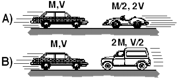

Compare two collisions that are perfectly inelastic.  In case (A) a car
traveling with velocity V collides head-on with a sports car having half
the mass and traveling in the opposite direction with twice the speed.
In case (B) a car traveling with velocity V collides head-on with a
light truck having twice the mass and traveling in the opposite
direction with half the speed.  In which case is the impulse delivered
to the car during the collision the greatest?

1. A 
2. B 
3. Both the same 
4. Cannot be determined

### Answer

(3) The impulse delivered to the automobile is the same in both cases.
In both cases the initial momentum of the automobile is MV to the right
and the final momentum is zero.

### Background

Impulse is related to the change in momentum. This question provided the
opportunity to discuss the definition of impulse [integral of force over
time interval] and its relation to momentum change. Many students think
I=Δp is the definition of impulse rather than the result of Newton's
second law. Students should realize that no statement can be made about
the forces exerted on the two cars - only that the integral of the force
over the collision time is the same.

### Questions to Reveal Student Reasoning

How do the forces acting on the car in the two cases compare? Which
collision takes longer?

### Suggestions

Set up the comparison with collision carts. 
...
