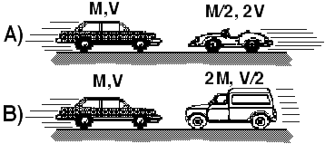

## The question for students:

Compare two collisions that are perfectly inelastic.  In case (A) a car
traveling with velocity V collides head-on with a sports car having half
the mass and traveling in the opposite direction with twice the speed.
In case (B) a car traveling with velocity V collides head-on with a
light truck having twice the mass and traveling in the opposite
direction with half the speed.  In which case is the work done on the
car during the collision the greatest?

1. A
2. B
3. Both the same
4. Cannot be determined

## Commentary for teachers:

### Answer

(4)  The total momentum of both systems is zero, so after the collision
there is no KE in either system.  System (A) has more kinetic energy
initially.  There is no way, however, to determine how much of the
kinetic energy in the combined system of the two vehicles is dissipated
in the automobile as opposed to the other vehicle.

### Background

This question serves only to provoke a discussion of the dissipation of
energy in a collision.    Students are tempted to assume that each
vehicle must absorb its own initial KE.

### Questions to Reveal Student Reasoning

How do the forces acting on the car in the two cases compare?

Which collision takes longer?

Which vehicle do you think will suffer the greatest <b>damage</b>?

### Suggestions

Promote a discussion of auto safety.
