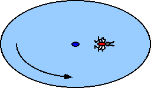

## The question for students:

{: .image-right } 

A bug walks on a freely rotating disk.  Given: Mbug=0.05 kg,
Idisk=0.03 kg-m2, Rdisk=0.5 m, and
&omega;o= 2 rad/s when bug is 0.1 m from center.  The bug
crawls to 0.4 m from the disk's center.  The final &omega; is most
nearly:

1. 1.6 rad/s
2. 1.2 rad/s
3. 1.0 rad/s
4. 0.8 rad/s
5. 0.5 rad/s
6. None of the above
7. Cannot be determined

## Commentary for teachers:

### Answer

(1) This is a very traditional conservation of angular momentum problem.
The only difficulty is due to the presence of extraneous information.
Some students may use conservation of energy.
