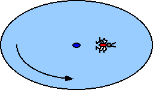

{: .image-with-caption } 

A bug walks on a rotating disk.  Given: Mbug,
Idisk, Rdisk, and &omega;o when the bug
is at r1. The bug crawls to r2.  Find
&omega;final for the system.

What principle would you use to solve the problem MOST EFFICIENTLY?

1. Kinematics only
2. F = ma or Newton's laws
3. Work-Energy theorem
4. Impulse-Momentum theorem
5. Angular Impulse-Angular Momentum theorem
6. Not enough information given

### Answer

(5) This problem helps students develop a principle-based approach to
problems. Many students may think correctly that this is a conservation
of angular momentum problem and not recognize that the general principle
is the angular impulse - angular momentum theorem.
...
