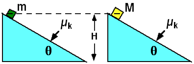

Two masses (M > m) are on an incline.  Both surfaces have the same
coefficient of kinetic friction.  Both objects start from rest, at the
same height.  Which mass has the largest speed at the bottom?

1. m
2. M
3. Both have the same speed.
4. Cannot be determined

### Answer

(3) Both will have the same speed. All the forces acting on the mass
(normal, friction, gravity) are proportional to the mass so the mass
cannot affect the acceleration experienced by the mass.
