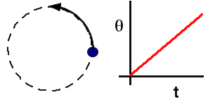

{: .image-right } 

A mass moves in a circle with uniformly increasing angle.

As the angle &theta; increases, the linear acceleration of the mass has
...

1. constant magnitude and direction.
2. constant magnitude, changing direction.
3. changing magnitude, constant direction.
4. both magnitude and direction changing.

### Answer

(2) Students have a lot of difficulty reconciling linear kinematics with
angular kinematics. Unless shown how to take derivatives in polar
coordinates, or shown how to represent rotational kinematic quantities
as vectors, students can only memorize specific relationships.

Some students may answer (1) thinking that 'towards the center' is a
direction.
