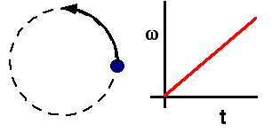

## The question for students:

{: .image-right } 

A mass moves in a circle with uniformly increasing anglular velocity.

As the angular velocity &omega; increases, the linear acceleration of
the mass has...

1. constant magnitude and direction.
2. constant magnitude, changing direction.
3. changing magnitude, constant direction.
4. both magnitude and direction changing.

## Commentary for teachers:

### Answer

(4) This requires exploration. Some students may think that the
direction is changing because the acceleration points toward the center
of the circle. They may be unaware that there is also a component of the
acceleration in the tangential direction.

Some students may answer (3) thinking only of the radial acceleration
and that 'towards the center' is a direction.
