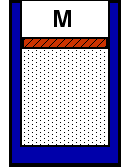

{: .image-right } 

A quantity of gas is confined to a cylinder.  The cylinder is vertical
and capped by a moveable piston of mass 2 kg and area 0.1 m2.
The gas is heated until the piston rises 20 cm.  The amount of work done
by the gas is most nearly

1. 4 J
2. 1 J
3. -20 J
4. 0.4 J
5. None of the above
6. Cannot be determined

### Answer

(1) This problem helps interrelate concepts from mechanics and
thermodynamics.  The work can be determined from the work done against
the gravitational force.
...
