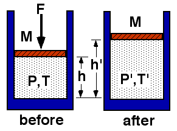

{: .image-with-caption } 

An ideal gas is allowed to expand slowly. The system is thermally
isolated.

Which statement regarding the final pressure is true?

1. P' < P 
2. P' = P 
3. P' > P 
4. Not enough information

### Answer

(1) For adiabatic expansion, pV&gamma; is constant.  Since
the volume increases, the pressure must decrease.

This result can also be reasoned by realizing that the gas won't expand
unless the external pressure on the piston is reduced.  The gas expands
because the piston moves to equalize the internal and external pressure.
...
