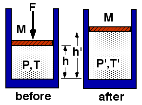

## The question for students:

{: .image-right } 

An ideal gas is allowed to expand slowly. The system is thermally
isolated.

Which statement regarding the final temperature is true?

1. T' < T 
2. T' = T 
3. T' > T 
4. Not enough information

## Commentary for teachers:

### Answer

(1) For adiabatic expansion, TV(&gamma;-1) is constant. 
Since the volume increases, the temperature must decrease.

This result can be reasoned by considering the fact that work is done by
the gas.  Since there is no heat transfer, the internal energy must
decrease.  Since the internal energy of a perfect gas depends only upon
temperature, the temperature must decrease.
